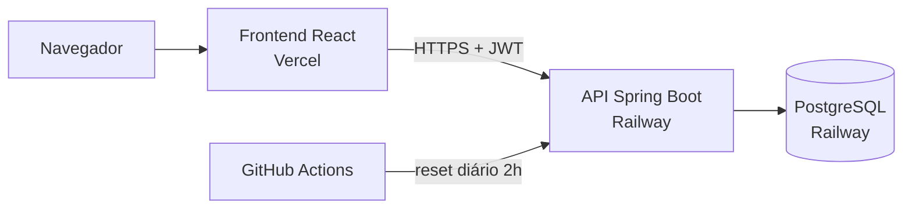
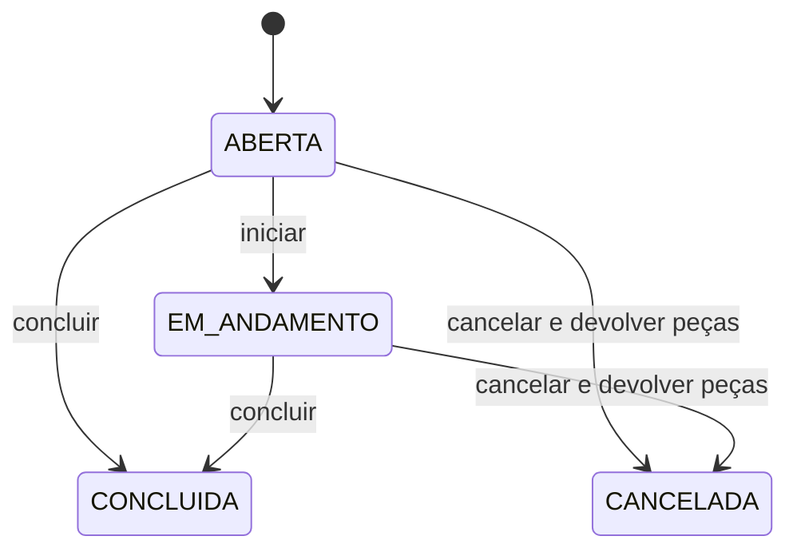

# GestãoManutenção — API

[](https://github.com/Jcarvasousa/gestao-manutencao-api/actions/workflows/ci.yml)


Sistema de gestão de manutenção industrial (CMMS) com controle de estoque de peças, custo por manutenção e relatórios em PDF. Este repositório é o **backend** (API REST). O frontend está em [frontend-gestao-manutencao](https://github.com/Jcarvasousa/frontend-gestao-manutencao).


## Demonstração ao vivo

| | |
|---|---|
| Aplicação | https://frontend-gestao-manutencao.vercel.app |
| API | https://gestao-manutencao-api-production.up.railway.app/api |
| Swagger (documentação interativa) | https://gestao-manutencao-api-production.up.railway.app/swagger-ui.html |
| Login de demonstração | usuário `demo` · senha `demo123` |

**Antes de abrir:**

- A hospedagem é de plano gratuito. Na **primeira visita o servidor pode levar até 1 minuto para acordar**. Depois disso responde normalmente.
- Os dados são **fictícios e reiniciados todo dia às 2h (horário de Brasília)**. Pode mexer à vontade.

## Roteiro de 2 minutos

1. **Dashboard:** KPIs (backlog, MTTR, orçamento do mês, custo do mês), manutenções por status, peças abaixo do mínimo, custo dos últimos 12 meses e custo por setor.
2. **Manutenções → Detalhes** de uma manutenção *Aberta*: registre o uso de uma peça, devolva uma unidade, vincule um técnico com horas e clique em **Concluir**.
3. Volte ao **Dashboard**: backlog, status e custos mudam sem recarregar a página.
4. **Relatórios:** custo por setores e por várias máquinas de setores diferentes, com **PDF**.
5. **Peças:** confira que o saldo baixou com o uso e voltou com a devolução.


## O problema

O projeto nasceu de um problema real relatado por um gestor de manutenção industrial: o estoque de peças não era confiável e isso levava a compras desnecessárias. O sistema liga **peça usada → manutenção → custo**, para o estoque refletir o que foi consumido e o gestor enxergar quanto cada máquina e cada setor custa.

## Funcionalidades

- **Cadastros:** setores (com ativar/inativar), máquinas, peças, técnicos e orçamento mensal.
- **Manutenções:** abrir, iniciar, concluir e cancelar, com campos alinhados à NR12 (descrição do serviço, condições de segurança, liberação da máquina).
- **Estoque com rastreabilidade:** entrada, saída, ajuste e devolução, sempre com registro da movimentação.
- **Custos por manutenção:** peças, mão de obra interna (horas × custo da hora) e serviços de terceiros.
- **Compras:** solicitação, bloqueio de compra desnecessária e recebimento com valor pago.
- **Relatórios (JSON e PDF):** custo mensal, por máquina, por várias máquinas, por setores, gasto realizado e orçamento mensal/anual.
- **KPIs:** backlog e MTTR.
- **Segurança:** autenticação JWT.

## Arquitetura



Camadas: `Controller → (Service, só onde há lógica real) → Repository → Entity`. Os DTOs são `record` com `fromEntity(...)`.



## Regras de negócio que valem a leitura

### Custo de manutenção

Considera **apenas manutenções concluídas**, no mês da conclusão:

```
custo = peças (saídas − devoluções, pelo custo unitário do momento da saída)
      + terceiros (valor final, quando informado; senão o valor apurado)
      + Σ (horas do técnico × custo da hora do técnico)
```

- Custo da hora do técnico = salário mensal ÷ (22 × carga horária diária).
- Manutenção em andamento ou cancelada não entra no custo.
- **Gasto realizado** é outra visão, de caixa: compras de peças **recebidas** no período + serviços de terceiros. Salário de técnico nunca entra. As duas visões são diferentes de propósito, e os PDFs explicam a diferença.

### Estoque

- O saldo fica em `Peca.quantidadeAtual`; `MovimentacaoEstoque` é o log (ENTRADA, SAIDA, AJUSTE, DEVOLUCAO).
- Toda **saída** grava o custo unitário do momento (*snapshot*), exige manutenção não finalizada e bloqueia estoque insuficiente.
- **Devolução por lote (LIFO):** a devolução desempilha as saídas da mesma manutenção da mais recente para a mais antiga e grava **uma linha por lote**, com o custo daquele lote. Exemplo: saída de 3 un a R$ 10 e depois de 2 un a R$ 12; devolver 3 gera 2 un a R$ 12 e 1 un a R$ 10. Assim o custo líquido da manutenção fecha exatamente.
- **Cancelar** uma manutenção devolve todas as peças ainda não devolvidas, na mesma transação.
- As saídas e devoluções usam trava pessimista (manutenção, depois peça) para evitar duas operações simultâneas sobre o mesmo saldo.

### Compras

- Receber uma compra exige o **valor total pago**. O custo unitário da peça passa a ser `valor ÷ quantidade` (regra do último preço). Exemplo: R$ 850 ÷ 17 = R$ 50,00.
- Receber uma compra já recebida ou cancelada é bloqueado antes de qualquer efeito.

### Serviços de terceiros

- `valorApurado`: informado direto **ou** calculado por `horas × valor/hora`, nunca os dois modos juntos.
- `valorFinal`: opcional, registrado depois pelo gestor quando a nota foi aceita e o pagamento caiu. Pode ser editado mesmo com a manutenção concluída. Os relatórios usam `COALESCE(valorFinal, valorApurado)`.
- Nenhum documento fiscal é exigido para concluir uma manutenção, porque a nota costuma sair semanas depois do serviço.

### Indicadores

- **Backlog:** manutenções fora de concluída e cancelada.
- **MTTR:** média em horas de (conclusão − início) das manutenções **corretivas concluídas** que têm data de início.

### NR12

Os campos de conclusão acompanham a norma. **O sistema não alega conformidade completa com a NR12**: falta, por exemplo, o cronograma e o plano preventivo.

## Decisões técnicas

| Decisão | Por quê |
|---|---|
| JWT stateless | Frontend e API em domínios diferentes. |
| Camada de serviço só onde há lógica real | Evita serviços que só repassam chamadas ao repositório. |
| `@ManyToOne` sempre `LAZY` + `@EntityGraph` + `open-in-view=false` | Evita `LazyInitializationException` e consultas N+1 escondidas. |
| Nunca montar o DTO a partir do retorno do `save()` | Usa a entidade original, que já está carregada. |
| Regra de negócio violada = exceção própria + handler (409 ou 400) | Contrato de erro previsível para o frontend. |
| Trava pessimista em saída e devolução | Sem ela, duas requisições simultâneas leem o mesmo saldo. |
| Relatórios reutilizam o cálculo por máquina | Uma única regra de custo; o relatório por setor soma o que já foi validado. |
| PDFs com OpenPDF, layout único | Todos os relatórios com `R$`, tabela, gráfico de barras e uma seção "Como ler este relatório". |
| Seed determinístico (`Random(42)`) com datas relativas a `now()` | Demonstração reproduzível, reiniciada por um job diário. |
| `ddl-auto=update` | Dados fictícios. Migrações versionadas estão no roadmap. |

## Limitações declaradas

- **O sistema não verifica valores digitados** (horas trabalhadas, valor de terceiro). Controle real, com técnico lançando e gerente aprovando, exige perfis de acesso (RBAC), que **não existem neste repositório**: o login é único, sem papéis. O relatório nunca é mais preciso do que a informação que entra.
- **Custo por último preço**, não por custo médio ponderado.
- **Sem estorno de compra recebida por engano.**
- O custo da hora do técnico é calculado na hora da consulta. Alterar o salário de um técnico muda o custo histórico das manutenções dele.
- **Sem migrações versionadas** (`ddl-auto=update`). Alterações de CHECK e colunas obrigatórias são feitas à mão.
- Busca e filtros não ignoram acentos.
- Não há MTBF, disponibilidade nem CMF.
- O relatório por setores faz dezenas de consultas por requisição (cerca de 75 com 25 máquinas). É aceitável neste volume e é o custo de reutilizar a regra por máquina.
- Como as datas do seed são relativas ao momento do reset, o custo do **mês atual** e o percentual do orçamento variam de um dia para o outro.
- As travas pessimistas não têm teste de concorrência (testes com Mockito não provam trava).
- O Swagger está público em produção, por decisão de portfólio.

## API

Tudo sob `/api`, com `Authorization: Bearer <JWT>`, exceto o login. A documentação completa e interativa está no Swagger.

| Recurso | Principais endpoints |
|---|---|
| Autenticação | `POST /auth/login` |
| Setores, máquinas, peças, técnicos | CRUD com filtros, busca e paginação |
| Manutenções | `POST`, `GET`, `PATCH /{id}/iniciar`, `/concluir`, `/cancelar`, `GET /{id}/pecas-usadas` |
| Técnicos da manutenção | `GET`, `POST`, `DELETE /manutencoes/{id}/tecnicos/{vinculoId}` |
| Serviços de terceiros | `GET`, `POST`, `PUT` (valor final), `DELETE` |
| Estoque | `GET /movimentacoes-estoque`, `POST` em `/entrada`, `/saida`, `/ajuste`, `/devolucao` |
| Compras | `POST`, `GET`, `GET /pendentes`, `PATCH /{id}/receber` |
| Orçamentos | `POST`, `GET`, `PUT` por mês; `GET /ano/{ano}` |
| Relatórios | `custo-mensal`, `custo-maquina/*`, `custo-maquinas`, `custo-setores`, `gasto-realizado`, `orcamento-mensal`, `orcamento-anual`, `kpis`. Cada um tem `/pdf`, exceto `kpis`. |
| Demonstração | `POST /admin/reset-demo` |

## Testes e CI

- **100 testes automatizados** (JUnit 5 + Mockito), incluindo teste de integração das consultas de custo contra PostgreSQL real, geração dos PDFs (conteúdo e paginação) e as regras de estoque, compras, devolução e terceiros.
- **GitHub Actions** (`ci.yml`): sobe um PostgreSQL 16 e roda `./mvnw clean test` a cada push e pull request.
- Um segundo workflow (`reset-demo.yml`) reinicia os dados de demonstração todo dia às 2h (Brasília).

## Como rodar localmente

Pré-requisitos: **Java 25** e **PostgreSQL** com um banco vazio chamado `gestao_manutencao`.

```bash
git clone https://github.com/Jcarvasousa/gestao-manutencao-api.git
cd gestao-manutencao-api

# copie o arquivo de exemplo e preencha a senha do banco e o segredo do JWT
cp src/main/resources/application.properties.example src/main/resources/application.properties

./mvnw spring-boot:run     # no PowerShell: .\mvnw spring-boot:run
```

A API sobe em `http://localhost:8080`. Para popular os dados de demonstração, faça login e chame `POST /api/admin/reset-demo`. Testes: `./mvnw test`.

Propriedades principais (nunca versione os valores): `spring.datasource.url`, `spring.datasource.username`, `spring.datasource.password`, `app.jwt.secret` (obrigatória, sem valor padrão) e `app.cors.allowed-origin`.

## Deploy

- **Railway:** Dockerfile em dois estágios (Maven + JDK 25 no build, JRE 25 na imagem final) e PostgreSQL gerenciado. O deploy acontece a cada push na `main`.
- **Vercel:** o frontend. A variável `VITE_API_URL` aponta para a API.

## Estrutura

```
src/main/java/br/com/joaovitor/gestaomanutencao/
  controller/     endpoints REST
  service/        lógica de negócio (estoque, compras, cancelamento, custos)
  repository/     Spring Data JPA + consultas de custo
  specification/  filtros dinâmicos de listagem
  model/          entidades e enums
  dto/            records de entrada e saída
  exception/      exceções de negócio e GlobalExceptionHandler
  security/       JWT
  pdf/            geração dos PDFs de relatório
  util/           utilitários (ex.: cálculo de percentual)
```

## Roadmap

- Perfis de acesso (gestor e técnico) e aprovação de valores lançados.
- Migrações versionadas (Flyway ou Liquibase).
- Estorno de compra recebida e custo médio ponderado.
- Plano preventivo e cronograma (para aproximar da NR12), MTBF e disponibilidade.
- Ancorar as datas do seed no calendário, para os números do mês atual não variarem entre resets.

## Autor

**João Vitor Carvalho de Sousa** — [github.com/Jcarvasousa](https://github.com/Jcarvasousa)

Os dados do sistema são fictícios.
